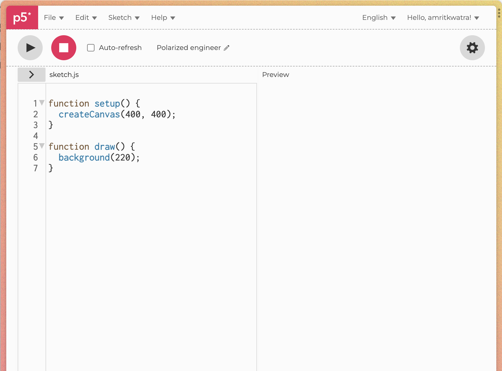

# Creating Design Tools
Today we will be examining how to use existing programming frameworks and tools to develop our own design tools. Rather than using software to create parts, we'll draft a program that can create a design to be fabricated.. 
We will be using the online p5 editor for lab, you can follow along with the example by opening your own editor here: https://editor.p5js.org/. 

### About `p5`
>p5.js is a JavaScript library for creative coding, with a focus on making coding accessible and inclusive for artists, designers, educators, beginners, and anyone else! p5.js is free and open-source because we believe software, and the tools to learn it, should be accessible to everyone.

For us, p5 offers a well documented set of tools to help us create a prototype design interface. In this lab, and in general use of the p5 library, it'll be necessary to read the documentation to learn what each function does. You can find the documentation here: https://p5js.org/reference/

The online editor we will be using appears like this:

The `setup()` function is invoked once at the start of the script and is used to define properties of the script as well as load external resources such as images, videos or fonts. It's important to note that variables should not be initialized within `setup()` if you want to access them in `draw()`  since they will not be in scope outside of the function. Instead, initialize variables outside both functions and they will be accessible within both `setup` and `draw`.

The `draw()`  function on the other hand, will continuously execute in a loop and is often populated with commands to render graphics onto the canvas. 

While we'll share the in class example with you all to look at today, it's valuable to follow along step by step in case you're not familiar with p5 or javascript. 

### Primitives
To start, we will look through the set of primitive shapes and geometry that the p5 defines. Examining the p5 documentation we can see there are a set of shapes and shape generation commands we can use.

For this example, we'll start with the `line` primitive, however you'll soon see how we can create our own primitive for our program. 

#### Drawing a Line
Examining the documentation for `line`, we can see that the function takes four parameters referencing the start and end coordinates of the line. We can draw a line on our canvas by adding the following to our script:

To draw multiple lines on our canvas we can create a for loop and invoke the line command within the loop. For example, here we create a variable `y_increment` and draw a line based on that fixed increment over the canvas using a for loop. 

### Creating our own Line Primitive
To add some more variance to our canvas, we will now create our own line primitive, which we will call `noisy_line`. 
While the basic line function is useful, it'll be helpful to have more control over how the line behaves across the canvas. To do this, we'll use p5's `beginShape()`, `vertex()`, and `endShape()` commands, which allow users to create custom shapes. Our goal is to create a line made up of smaller line segments which we can control. 

Here we added a function `noisy_line` that creates a shape made up of many connected vertices. However, you may notice, it looks the same as our original canvas using the much simpler `line` primitive. The usefulness of defining our own primitive kicks in when we begin to manipulate the vertices individually. A naive way to do this is to add some vertical noise to each vertex in the form of a random `nudge`. 

Upon adding this nudge to our code we'll see that the canvas is creating random perturbations to each vertex. (Note: to have the same generated canvas in each iteration of the draw loop, add a call to `randomSeed` in your draw function, this will ensure the random nudges are the same in each iteration of the draw loop.)

### Controlled Variance
While it's interesting that we can randomly add noise to each vertex to create a canvas that's more visually interesting, it'd be useful to manipulate the points it in a more user-controllable way. We will do this using the builtin `mouseX` and `mouseY` variables which dynamically track the position of the mouse. To control the variance in our canvas we will scale the noise based on how close the vertex is to our mouse. To do this we define a new function called `distance_from_mouse` that will return the distance of any x, y coordinate to our mouse.  (Note: I have renamed the local `y_height` variable here for convenience)

We now need to find a way to modify the nudge variable such that the value is higher when the distance to the mouse is small, and lower when the distance to the mouse is large. One way to do this is to simply divide by the distance from the mouse.

As you can see above, despite moving across the canvas, the lines have returned to their orderly state and are not responding to the mouse. This is because we haven't scaled our adjustment correctly, we can do this by adjusting how we use the `distance_from_mouse` result. 

That's better - we're now able to control the perturbation using our mouse as input. However, our input options are not just limited to the mouse, we could parametrize this canvas in a host of ways. For example, with a quick change to our code to only preturb vertices in the center of our canvas and some color changes we've come close to recreating a famouse generative art album cover:

### Recap
Together we've learned how to use primitives defined by a library (in this case p5.js), write code to adjust and control the primitives on the canvas, and finally use user input commands to control the primitives. This is the essence of a design tool, and once you know which knobs to turn you can swap out components to experiment freely. These 2D designs can then be exported to be [plotted with a pen plotter](https://www.youtube.com/watch?v=X1921Y4pmqo) or etched with a laser engraver. To view the code we've discussed here today, you can go [here](https://editor.p5js.org/amritkwatra/sketches/kC9qpY4fn).

### Your Turn
Now that you know the basic building blocks of creating a design tool, create one for yourself using the primitives and input methods offered in p5.js. Write a p5 program that creates a design using the existing p5 primitives and some form of user input. This doesn't need to be dynamic, and could instead by a user-specified piece of media or website. The [examples](https://editor.p5js.org/siunami/sketches/HkXTkdzfN) [are](https://editor.p5js.org/kariina/sketches/CIedVmB-y) [endless](https://editor.p5js.org/codingtrain/sketches/nFOs57gVh) [...](https://p5js.org/examples/sound-note-envelope.html) [...](https://p5js.org/examples/math-noise3d.html) There are a lot of useful pointers in the p5 documentation on how to use different inputs (audio, video, still images, keyboard, mouse) and we are here to help you make something interesting. 

### What to turn in 
1. A link to your script hosted on the p5 editor so we can run your experiment. (4 points).
2. An image, or video of the script running (4 points).
3. A description of how you would fabricate the design into a physical thing. If it's not fabricable, how would you share this with others (2 points).
